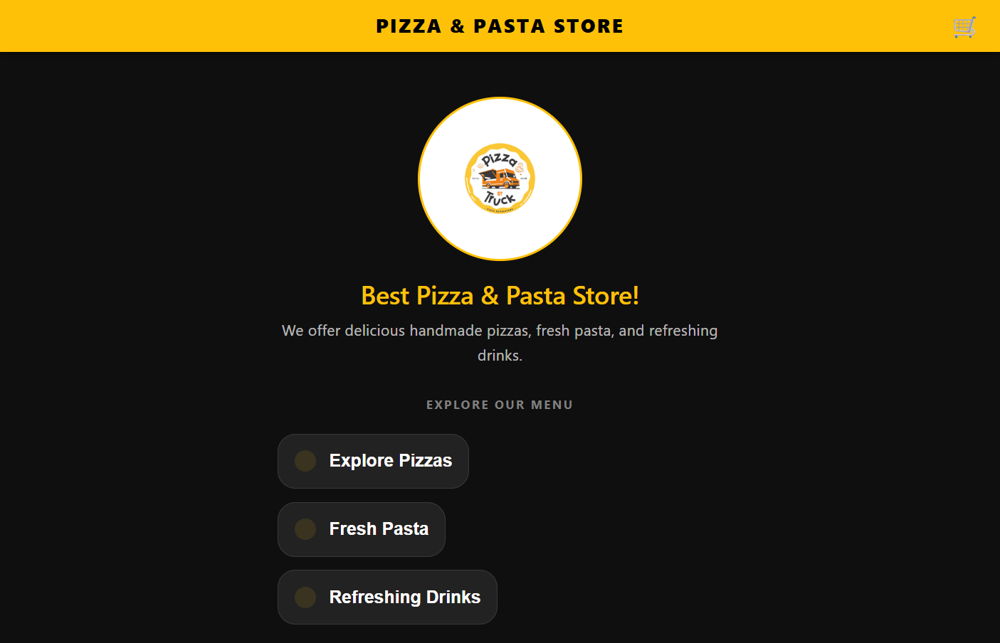
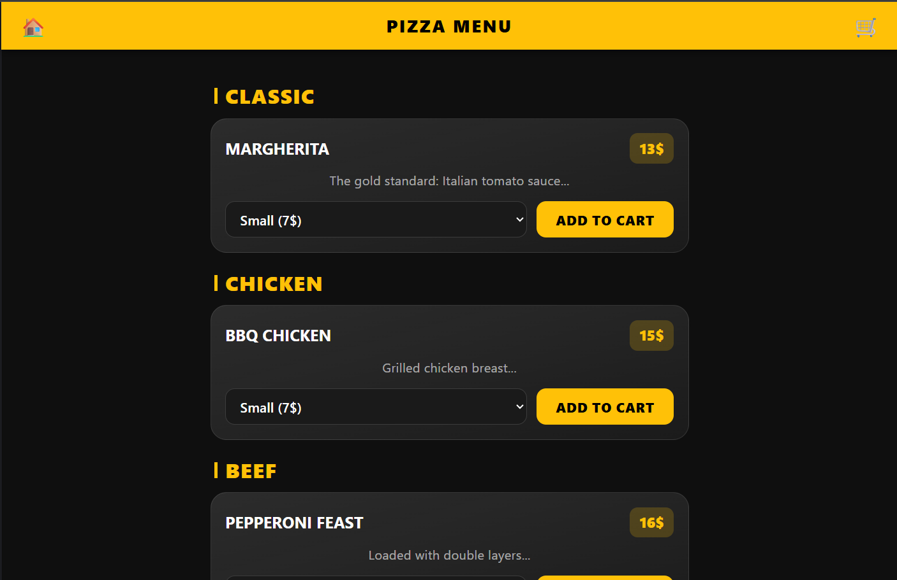
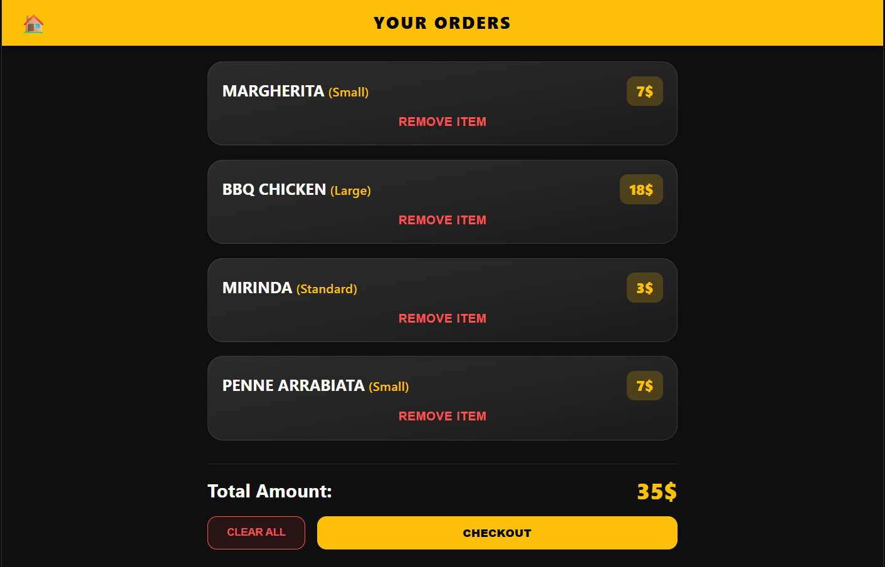

# 🍕 Pizza & Pasta Store

A sleek and responsive web application designed for a modern food ordering experience. Built with a clean UI, intuitive navigation, dynamic cart management via `localStorage`, and responsive layouts, this application offers users an efficient way to browse pizzas, pasta, and drinks, customize order sizes, and manage their cart seamlessly.

---

## 🚀 Live Demo

🔗 **Live Application:** [Deploy on Vercel](https://pizza-truck-pearl.vercel.app/)

---

## 📸 Screenshots

| Home Screen | Menu Overview |
| :---: | :---: |
|  |  |

| Customization & Options | Cart & Order Summary |
| :---: | :---: |
| 

---

## ✨ Key Features

- 🍕 **Categorized Menu Navigation:** Easily browse through distinct categories for Handmade Pizzas, Fresh Pastas, and Refreshing Drinks.
- 📐 **Dynamic Size & Pricing Selection:** Options for Small, Medium, and Large portions with auto-calculating price tiers.
- 🛒 **Persistent Shopping Cart:** Powered by `localStorage` so user selections persist across page refreshes and session browsing.
- 💳 **Order Management:** Add items, view detailed item breakdowns, remove individual items, or clear the entire cart with real-time total updates.
- 🎨 **Modern Dark UI:** Styled with a dark-mode palette, crisp iconography (FontAwesome), responsive cards, and accent highlights.
- 📱 **Mobile-First & Responsive:** Optimized across desktop, tablet, and mobile device viewport sizes.

---

## 🛠️ Tech Stack & Architecture

- **Frontend:** HTML5, CSS3, JavaScript (ES6+)
- **Icons:** Font Awesome
- **Storage:** Web Storage API (`localStorage`)
- **Deployment:** Vercel

---

## 📁 Project Structure

```text
├── index.html          # Main HTML entry point & viewport container
├── styles.css          # Core CSS styling, dark theme, layout, & responsive UI
├── app.js              # Application logic, route management, cart handling, DOM rendering
├── logo.png            # Store branding logo
└── screenshots/        # Application preview images (for documentation)